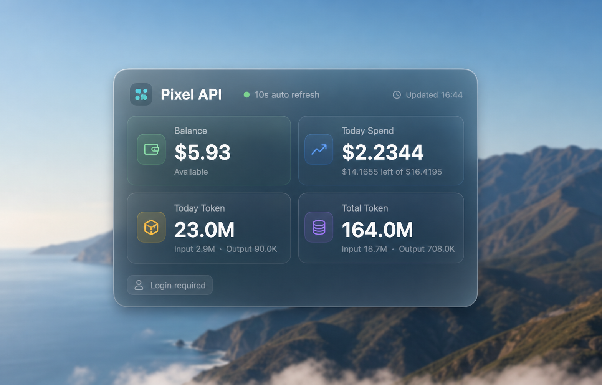

# Pixel API macOS 桌面小组件

这是一个使用 Xcode / AppKit 编写的 macOS 原生桌面浮窗应用，用来登录 Pixel API 控制台并显示核心用量数据。



## 功能

- 显示余额、今日消费、今日 Token、累计 Token。
- 首次使用账号密码登录，不需要手动填写 token。
- 登录成功后把 access token / refresh token 保存到 macOS Keychain。
- 每 10 秒刷新一次数据。
- token 失效或接口失败时，在浮窗内显示状态。
- 浮窗位置会保存到本机偏好设置。

## 能不能共享给别人安装？

可以共享，但要注意两种方式：

1. 推荐共享源码：对方用 Xcode 打开项目后自行构建运行。
2. 也可以共享 `.app`：但如果没有 Apple Developer ID 签名和公证，别人第一次打开时可能会看到 macOS 安全提示，需要在“系统设置 > 隐私与安全”里允许打开。

如果要长期给别人使用，建议用 Apple Developer ID 对 App 签名并公证。当前项目默认适合个人本机使用和源码共享。

## 从源码安装

### 1. 安装 Xcode

在 Mac App Store 安装 Xcode，或确保本机已有完整 Xcode。

检查命令：

```bash
xcodebuild -version
```

### 2. 克隆仓库

```bash
git clone https://github.com/stepven8/PixelAPIDesktopWidget.git
cd PixelAPIDesktopWidget
```

### 3. 打开项目

```bash
open PixelAPIDesktopWidget.xcodeproj
```

在 Xcode 中选择 `PixelAPIDesktopWidget` Scheme，然后点击运行。

### 4. 命令行构建

```bash
xcodebuild \
  -project PixelAPIDesktopWidget.xcodeproj \
  -scheme PixelAPIDesktopWidget \
  -configuration Release \
  build
```

构建产物通常在 Xcode 的 DerivedData 目录里。也可以在 Xcode 里使用 `Product > Show Build Folder in Finder` 查找。

### 5. 安装到“应用程序”

只是在 Xcode 里运行，或只把 App 放在构建输出目录里，并不会自动出现在访达左侧的“应用程序”里。要让它像普通 App 一样出现在“应用程序”，需要把 `.app` 复制到 `/Applications`：

```bash
rm -rf /Applications/PixelAPIDesktopWidget.app
cp -R path/to/PixelAPIDesktopWidget.app /Applications/PixelAPIDesktopWidget.app
open /Applications
```

如果你是从当前仓库根目录按命令行构建，可以先在 Xcode 的构建目录里找到 `PixelAPIDesktopWidget.app`，再替换上面命令里的 `path/to/PixelAPIDesktopWidget.app`。

## 使用方法

1. 双击 `/Applications/PixelAPIDesktopWidget.app`，或运行 `open /Applications/PixelAPIDesktopWidget.app`。
2. 点击浮窗右上角“登录”。
3. 输入 Pixel API 账号邮箱和密码。
4. 登录成功后，浮窗会自动显示余额、今日消费、今日 Token、累计 Token。
5. 后续重新打开 App 时，会从 macOS Keychain 读取 token，不需要重复输入密码。

## 数据接口

应用按 Pixel API 当前网页行为调用：

- `POST https://ai-pixel.online/api/v1/auth/login`
- `GET https://ai-pixel.online/api/v1/auth/me?timezone=Asia%2FShanghai`
- `GET https://ai-pixel.online/api/v1/usage/dashboard/stats?timezone=Asia%2FShanghai`

登录时会从 `https://ai-pixel.online/login` 读取当前的 `login_agreement_revision`，再随登录请求提交，保持和网页登录一致。

## 隐私和安全

- 项目源码里不包含账号、密码、token 或 API Key。
- 密码只用于登录请求，不会保存到本地文件。
- token 保存在 macOS Keychain，service 名称是 `online.ai-pixel.desktop-widget.native`。
- 如果要清除本机登录状态，可以运行：

```bash
security delete-generic-password \
  -s online.ai-pixel.desktop-widget.native \
  -a credentials
```

## 常见问题

### 为什么访达“应用程序”里没有这个 App？

因为 Xcode 构建出来的 `.app` 默认在 DerivedData 或项目自己的输出目录里，不会自动安装到 `/Applications`。把 `PixelAPIDesktopWidget.app` 复制到 `/Applications` 后，访达“应用程序”里就能看到。

### 为什么别人打不开我发的 `.app`？

如果 `.app` 没有 Developer ID 签名和公证，macOS Gatekeeper 可能会拦截。解决方式：

- 推荐：让对方从源码用 Xcode 自行构建。
- 临时：右键点击 App，选择“打开”，或在“系统设置 > 隐私与安全”中允许打开。
- 正式分发：使用 Apple Developer ID 签名并公证。

### 为什么显示 HTTP 404？

通常是接口路径错误。当前代码已经使用 `/api/v1/auth/me` 和 `/api/v1/usage/dashboard/stats`，和网页控制台一致。

### 为什么显示需要重新登录？

可能是 token 过期、refresh token 失效，或 Pixel API 登录协议版本变化。点击“登录”重新登录即可。

## 开发说明

项目结构：

- `PixelAPIDesktopWidget.xcodeproj`：Xcode 工程。
- `PixelAPIDesktopWidget/Sources/APIClient.swift`：登录、刷新和统计接口。
- `PixelAPIDesktopWidget/Sources/KeychainStore.swift`：Keychain 存储。
- `PixelAPIDesktopWidget/Sources/AppDelegate.swift`：窗口和刷新逻辑。
- `PixelAPIDesktopWidget/Sources/WidgetViewController.swift`：主浮窗 UI。
- `PixelAPIDesktopWidget/Sources/LoginWindowController.swift`：登录窗口。

## 许可

本项目使用 MIT License，详见 `LICENSE` 文件。
